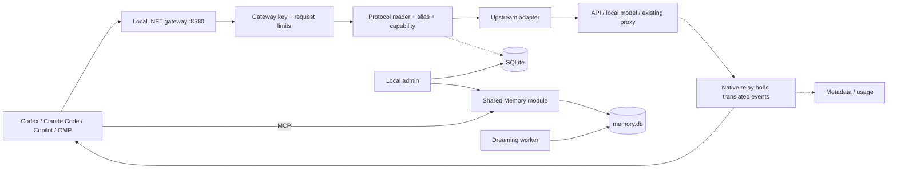

# Agentic Gateway — kiến trúc .NET cho local cá nhân

**Ngày:** 2026-09-26. **Trạng thái:** đề xuất, chưa implement.

Nguồn: [RESEARCH_VI.md](RESEARCH_VI.md). Backlog: [IMPLEMENTATION_PLAN_VI.md](IMPLEMENTATION_PLAN_VI.md).

## 1. Mục tiêu đã xác nhận

Bạn muốn **Codex/Claude Code/Kiro/Copilot là client gọi gateway để dùng model phía sau**, ưu tiên Codex; **chạy local cá nhân, đơn giản và Docker**.

Gateway cung cấp endpoint ổn định trên máy bạn, chọn upstream theo model/alias, quản lý credential và bảo toàn streaming/tool calling. Không cần nền tảng multi-user để giải quyết nhu cầu này.

Phân biệt client/harness, protocol, provider và model. Codex client dùng Responses không đồng nghĩa upstream phải là tài khoản Codex. Upstream có thể là OpenAI/Anthropic API, local model server, proxy đã có hoặc connector Codex/Kiro/Copilot. Một provider có thể phục vụ nhiều protocol tùy model/account.

MVP không bắt buộc Codex subscription upstream. Nếu model bạn muốn chỉ có qua connector đặc thù, kéo đúng connector đó vào lát cắt đầu; không bắt buộc làm cả ba connector cùng lúc.

Inference gateway không chạy terminal, sửa file hay điều phối subagent. Coding client sở hữu các hoạt động này; gateway chuyển tool call/result để vòng agent hoạt động. Theo yêu cầu bổ sung, cùng host có Shared Memory MCP module phục vụ remember/recall/handoff và dreaming worker riêng; xem [SHARED_MEMORY_VI.md](SHARED_MEMORY_VI.md).

## 2. Business flow và phạm vi

| ID | Nhu cầu | Nghiệm thu |
|---|---|---|
| B01 | Codex dùng gateway | Hoàn thành task đọc/sửa/test source qua tool loop |
| B02 | Đổi model phía sau | Alias đổi upstream trong cấu hình, client giữ endpoint |
| B03 | Claude Code/Copilot dùng cùng gateway | Protocol và stream/tool loop đúng subset công bố |
| B04 | Cài/khôi phục đơn giản | Một container .NET, SQLite volume, restart giữ cấu hình |
| B05 | Chẩn đoán route/usage | Requested/resolved model, TTFT, usage/error rõ |
| B06 | Kết nối ổn định | Timeout/cancel/retry không gây output trùng, mất tool result |
| B07 | Tận dụng nghiên cứu | Học adapter/test; proxy cũ có thể là upstream cấu hình |
| B08 | Kiến thức không phân tán giữa agent | Agent A ghi memory, B/C/D recall cùng project; dreaming tổng hợp có nguồn |

**MVP:** Responses native trước, generic upstream connection, alias/catalog, gateway key, SSE thật, non-stream, tool/reasoning preservation, SQLite, admin local tối thiểu, Docker.

**Mốc Shared Memory sau Codex alpha:** MCP dùng chung, memory theo project, handoff và dreaming nền cơ bản; mức capture chưa chốt, đề xuất selective writes. Memory dùng được độc lập với inference routing.

**V1 local:** gồm mốc Shared Memory, Messages/Chat adapters, Anthropic native, bridge subset, client setup/E2E, recent requests/usage. Kiro custom inference endpoint chỉ cam kết sau feasibility test; Kiro MCP memory là đường tích hợp riêng.

**Sau V1/theo nhu cầu:** connector account Codex/Kiro/Copilot, OAuth/multi-account, stored responses, WebSocket, n8n, OMP execution worker và full-transcript capture.

Ngoài V1: PostgreSQL/Redis, Kubernetes, tenant/RBAC doanh nghiệp, hard billing, agent execution và RAG toàn bộ corpus tài liệu.

## 3. Phương án kiến trúc

| Phương án | Lợi ích | Đánh đổi | Chọn |
|---|---|---|---|
| .NET modular monolith + adapters | Một runtime, kiểm soát wire contract | Tự duy trì adapter | **Core sản phẩm** |
| Gateway gọi proxy sẵn có như upstream | Sớm dùng model/account đang có | Thêm hop/phụ thuộc bên ngoài | Connection tùy chọn, tốt cho chuyển đổi |
| Nhúng OMP/Bun hoặc fork proxy khác | Nhiều adapter sẵn | Hai runtime, ownership state/auth phức tạp | Chỉ spike khi cần |

Không để executable .NET bắt buộc chạy proxy ngoài. Mọi connection có capability/contract riêng.

## 4. Stack và cấu trúc

| Thành phần | Lựa chọn |
|---|---|
| Runtime/host | .NET 10 LTS, ASP.NET Core/Kestrel |
| HTTP | IHttpClientFactory/SocketsHttpHandler + ResponseHeadersRead |
| JSON/stream | System.Text.Json, PipeReader, IAsyncEnumerable |
| Storage | SQLite + EF Core SQLite, WAL, một process ghi |
| UI | Razor Pages cùng host, JavaScript tối thiểu |
| Resilience | Application retry coordinator; Polly tùy nhu cầu thực tế |
| Telemetry | ILogger, Activity/Meter; OTLP tùy chọn |
| Tests | xUnit, WebApplicationFactory, mock upstream, SQLite file tạm |
| Deploy | Một image .NET, persistent data volume, secret mount |

.NET 10 là LTS theo [Microsoft](https://dotnet.microsoft.com/en-us/platform/support/policy); SDK local có 10.0.303. Pin patch/dependency khi implement.

[YARP](https://learn.microsoft.com/en-us/aspnet/core/fundamentals/servers/yarp/extensibility-transforms?view=aspnetcore-10.0) không có built-in body transforms: MVP dùng HttpClient pipeline, chưa cần thêm YARP. Semantic Kernel/Agent Framework không cần cho proxy không chạy agent loop. Microsoft.Extensions.AI có thể làm facade sau này; không thay wire adapter Responses bằng abstraction làm mất metadata.

```text
agentic-gateway/
  AgenticGateway.slnx
  global.json / Directory.Build.props / Directory.Packages.props
  src/
    AgenticGateway.Host/           # Endpoints, Security, Pages/Admin
    AgenticGateway.Core/           # Contracts, Routing, Execution, Connections, Usage
    AgenticGateway.Protocols/      # Responses, Messages, ChatCompletions, Streaming
    AgenticGateway.Providers/      # OpenAICompatible, Anthropic; connector khác khi cần
    AgenticGateway.Infrastructure/ # Persistence, Credentials, Http, Observability
  tests/
    AgenticGateway.UnitTests/
    AgenticGateway.ContractTests/
    AgenticGateway.IntegrationTests/
    client-e2e/
  deploy/
  docs/
```

Chưa scaffold các file này. Core không phụ thuộc EF/ASP.NET; ba library còn lại phụ thuộc Core; Host là composition root. Một project Providers đủ cho V1.

## 5. Luồng request



Authenticate → parse/validate → resolve capability/alias → giữ config snapshot → acquire connection slot/credential → call upstream → stream/aggregate → record metadata → dispose/cancel.

Không dùng LLM tự quyết route trong MVP. Native protocol được ưu tiên; chỉ translate khi có mapping được kiểm thử.

## 6. Contract nội bộ

Các signature định hướng backlog, chưa phải code:

```csharp
ValueTask<RequestEnvelope> IIngressReader.ReadAsync(
    Stream body, ProtocolKind protocol, CancellationToken ct);
ValueTask<RouteDecision> IModelRouter.ResolveAsync(
    RequestEnvelope request, CancellationToken ct);
ValueTask<ConnectionLease> IConnectionManager.AcquireAsync(
    RouteDecision route, CancellationToken ct);
ValueTask<ProviderExchange> IProviderAdapter.OpenAsync(
    ProviderInvocation invocation, CredentialSnapshot credential, CancellationToken ct);
IAsyncEnumerable<GatewayEvent> IUpstreamDecoder.DecodeAsync(
    ProviderExchange exchange, CancellationToken ct);
ValueTask IProtocolWriter.WriteAsync(
    Stream output, IAsyncEnumerable<GatewayEvent> events,
    ResponseContext context, CancellationToken ct);
```

| Type | Nội dung |
|---|---|
| RequestEnvelope | Protocol, public model, stream, original JSON, semantic fields, required capabilities |
| RouteDecision | ConnectionId, ProviderKind, upstream/public model, native protocol, capability/config version |
| ConnectionLease | Slot + immutable config generation; IAsyncDisposable |
| CredentialSnapshot | Version, expiry nếu có, secret chỉ dùng trong memory |
| ProviderInvocation | Route, shaped payload, approved headers, request/attempt ID |
| ProviderExchange | Status, approved headers, protocol, body stream, upstream ID; IAsyncDisposable |
| GatewayEvent | Lifecycle/text/tool/reasoning/usage/terminal, IDs/indices/sequence, opaque raw event |
| ResponseContext | Request ID, public model, protocol/mode, translation profile version |

Không dùng ChatMessage[] làm representation duy nhất. Native path giữ field/event chưa biết khi policy cho phép; translated path từ chối semantic feature không ánh xạ được bằng unsupported_feature. Không âm thầm xóa instructions, tool constraint, image, reasoning hoặc tool error.

Một upstream call/attempt. Non-stream dùng cùng decoder/reducer, không gọi lại model. Streaming pull-based; không tích toàn answer trừ non-stream có limit. Protocol decoder không được đọc body hai lần.

## 7. Endpoint và client matrix

| Endpoint | Mốc |
|---|---|
| GET /health/live, /health/ready | MVP; liveness không ping model |
| GET /v1/models | MVP; aliases/model cấu hình hoặc discover |
| POST /v1/responses | MVP; stream/non-stream, native trước |
| POST /v1/messages | V1; native Anthropic + bridge subset |
| POST /v1/chat/completions | V1; n=1, text/function tools |
| POST /v1/messages/count_tokens | V1; local count phải công bố estimate |
| POST /v1/responses/compact | Native-only khi connection verified |
| GET/DELETE /v1/responses/{id} | Sau V1 với stored-response module |
| /admin/* | MVP cấu hình tối thiểu; V1 thêm diagnostics/usage |
| /mcp | Mốc Shared Memory: remember/recall/handoff, auth/scope riêng |

V1 chưa có WebSocket ingress, background responses, audio/image generation, batch hoặc hosted tool emulation. Unsupported trả lỗi rõ.

| Client | Kết nối | Cam kết |
|---|---|---|
| Codex CLI | Custom provider, Responses HTTP/SSE | P0; tool loop và long session theo capability |
| Codex IDE/App local | Custom provider theo surface/version | Test riêng, không suy pass từ CLI |
| Codex cloud | Cần endpoint cloud truy cập được | Ngoài local V1 |
| Claude Code | ANTHROPIC_BASE_URL + gateway credential | Messages; bridge cross-model có giới hạn |
| VS Code Copilot | Custom Endpoint | Chat/Responses/Messages theo profile |
| Copilot CLI/SDK | BYOK nếu version hỗ trợ | Chứng nhận riêng với VS Code |
| Kiro IDE/CLI | Chưa xác nhận custom endpoint | Spike, không hứa đổi base URL được |
| OMP | models.yml custom provider | Client test bổ sung |

Nguồn: [Codex config](https://learn.chatgpt.com/docs/config-file/config-reference), [Claude protocol](https://code.claude.com/docs/en/llm-gateway-protocol), [VS Code Custom Endpoint](https://code.visualstudio.com/docs/agent-customization/language-models), [Copilot BYOK](https://docs.github.com/en/copilot/how-tos/copilot-sdk/auth/byok). [Kiro models](https://kiro.dev/docs/models/) chưa đủ để xác nhận custom inference endpoint của client cần dùng.

## 8. Upstream strategy

| Connection | Hành vi |
|---|---|
| Responses-compatible API | Native Responses; phù hợp nhất cho Codex client |
| Chat-compatible API/local server | Chat native, Responses bridge subset; không giả lập feature không có |
| Anthropic API | Messages native, Responses bridge subset |
| Existing 9router/Kiro proxy | Connection theo protocol thực sự có; cấu hình URL/key |
| Codex account backend | Connector tùy chọn; khác OpenAI API, auth/state riêng |
| Kiro account backend | Connector tùy chọn; binary EventStream/region/auth riêng |
| Copilot account backend | Connector tùy chọn; endpoint/capability theo model |
| Claude subscription/OAuth | Research riêng, không đồng nhất API key |

Capability hiệu dụng = protocol ∩ model ∩ entitlement ∩ translation support. Có version/provenance/timestamp/TTL. Tên model giống nhau ở hai host không bảo đảm capability giống nhau.

MVP cần một upstream thực để live test; implementation offline có mock nên không cần credential để bắt đầu viết core sau khi được phép.

## 9. Codex-first: bảo toàn hành vi agent

Theo [config reference](https://learn.chatgpt.com/docs/config-file/config-reference), custom provider dùng Responses. Mẫu dự kiến:

```toml
model_provider = "agentic-gateway"
model = "coding-default"
[model_providers.agentic-gateway]
name = "Agentic Gateway"
base_url = "http://127.0.0.1:8580/v1"
env_key = "AGENTIC_GATEWAY_API_KEY"
wire_api = "responses"
supports_websockets = false
```

Không tự ghi cấu hình cá nhân. Alias coding-default trỏ model bạn có; port 8580 configurable, tránh đụng 8080/8578.

Requirement bắt buộc:

1. instructions/system/developer theo upstream profile; quirk system-not-allowed của Codex backend không áp mọi Responses server.
2. Function/custom/freeform tools, tool results, parallel call, call_id/order giữ nguyên trên native path.
3. Tool/schema/grammar không ánh xạ được phải fail rõ, không bỏ constraint.
4. IDs/output_index/content_index/sequence/terminal đúng. HTTP 200 với error event vẫn failed.
5. Reasoning summary khác opaque encrypted reasoning/compaction. Không biến ciphertext thành text/signature giả hoặc chuyển provider tùy ý.
6. Delta/done/completed không nhân đôi output; recovery terminal output rỗng chỉ bật theo fixture/profile đã chứng minh.
7. Compact native khi verified. Nếu không có, kiểm tra client fallback hoặc công bố long-context limitation; không trả compact giả.
8. E2E đọc source → tool result → sửa source trong repo test → chạy test → kết quả; thêm cancel, hai phiên/subagent xen kẽ và resume/full-history.

Alias ổn định không đồng nghĩa mọi model phía sau đều có đầy đủ feature/chất lượng của Codex model.

## 10. Routing và config

Resolve explicit alias → explicit connection prefix → legacy mapping nếu có. Unknown model trả lỗi, không tự rơi về Kiro/Opus. Split slash đầu tiên, giữ model remainder chứa slash.

V1 mỗi request dùng một connection đã chọn. Không tự đổi provider/model sau lỗi. Optional fallback phải bạn bật, trước downstream commit, replay-safe, capability tương thích và history portable.

Config reload tạo generation mới; stream đang chạy giữ generation cũ. Disable connection ngừng admission mới và drain stream hiện tại. Không mutate HTTP_PROXY toàn process để đổi một connection.

## 11. Stream, retry và limits

State: Accepted → UpstreamOpening → Streaming → Completed/Failed/Cancelled.

Retry cần cả hai điều kiện: chưa commit downstream và upstream replay-safe. Chưa có token không chứng minh upstream chưa chạy hosted tool/tính phí.

| Lỗi | Xử lý |
|---|---|
| Invalid body/model/capability | 400, không retry |
| Gateway key sai | 401, zero upstream calls |
| Upstream auth invalid | Actionable error; OAuth connector có thể refresh một lần |
| 429 | Tôn trọng Retry-After; không xoay account vô hạn |
| Connect fail trước send | Bounded retry |
| Timeout/EOF sau body có thể tới upstream | Không replay mặc định |
| Lỗi sau commit | Protocol error/abort; không nối JSON lỗi vào SSE/đổi provider |
| Client disconnect | Cancel upstream, dispose exchange/lease |

Tắt retry POST/hedging tự động ở mọi HTTP/SDK layer. Một retry coordinator duy nhất. Parser xử lý UTF-8/SSE incremental, multiline data, partial TCP chunks. EOF không đồng nghĩa Completed.

| Mặc định đề xuất | Giá trị |
|---|---:|
| Request body sau giải nén | 16 MiB |
| Một SSE event | 8 MiB |
| Tool args ghép | 1 MiB |
| Non-stream accumulation | 16 MiB |
| Relay buffer ngoài event đang parse | 256 KiB/stream |
| Connect/first-event/idle | 10s/90s/90s |
| Total request | 20 phút |
| Upstream attempts | Tối đa 2 khi replay-safe |
| OAuth refresh retry nếu connector có | Tối đa 1 trong 2 attempts |
| Concurrency | 8/instance, 4/connection |
| Chờ slot | 2s rồi 429 |
| Catalog TTL/stale | 15 phút/24 giờ |
| Shutdown drain | 30s |

Đây là config khởi đầu, chưa benchmark. Nâng payload limit cần test bộ nhớ. Gateway/client retries không được nhân số attempts ngoài kiểm soát.

## 12. State và SQLite

MVP full-history + store=false; không persist prompt/response/tool output mặc định. Không claim complete stored Responses API.

previous_response_id chỉ forward khi native connection có verified continuation profile và binding đúng connection/session; nếu module chưa làm, trả unsupported, không bỏ ID rồi chạy thiếu context. Không gửi opaque state sang connection/model/account khác. Chưa có identity đủ tin cậy thì stateless/full-history; không suy session bằng hash prompt. Chứng nhận Codex ở profile SSE/full-history cụ thể.

Schema tối thiểu:

| Table | Nội dung |
|---|---|
| upstream_connections | Kind, URL/profile, enabled, concurrency, config version |
| protected_credentials | Encrypted payload, key/credential version |
| model_aliases/model_capabilities | Mapping, metadata/provenance/TTL |
| local_access_keys | ID/prefix/hash/purpose/revoke; một inference key mặc định |
| request_attempts | Route/status/timing/error redacted, không raw body |
| usage_records | Raw/normalized usage, Reported/Estimated/Unknown |
| settings | Cấu hình local có version |

SQLite transaction chỉ cho thao tác ngắn, không giữ xuyên SSE. WAL/busy timeout/bounded writer/retention tránh khóa DB và tăng bộ nhớ. Metadata write lỗi không replay inference; diagnostics phải thể hiện thiếu dữ liệu.

Usage không cộng cached/reasoning counters mù; giữ raw upstream values. Missing usage là Unknown/Estimated, không 0 giả. V1 không hard budget/billing; chỉ hiển thị/cảnh báo ngưỡng.

Stored response sau V1: store=true opt-in, encrypted history TTL 24h, namespace profile/client key/session/agent, versioned completion và get/delete. Đây không phải multi-tenant isolation guarantee.

## 13. Credential/admin local

Gateway inference key khác upstream key, chỉ lưu hash. Nhận Bearer cho Responses/Chat; Messages hỗ trợ x-api-key hoặc Bearer theo client profile. Nếu hai header có giá trị mâu thuẫn thì reject; không chuyển chúng nguyên trạng sang upstream. Admin bootstrap credential riêng, cookie HttpOnly/SameSite và antiforgery; không cần user directory/RBAC doanh nghiệp.

Credentials mã hóa AES-GCM hoặc cơ chế .NET tương đương có key version. Setup sinh master key một lần, file secret nằm ngoài SQLite/repo, mount read-only và bảo vệ filesystem permissions. Backup/restore key riêng; không sinh key đè khi restart. Mã hóa DB không bảo vệ được host bị chiếm toàn bộ.

OAuth/import chỉ ở connector phase, admin chủ động; không tự quét auth.json/AWS cache. Không để gateway và CLI cùng refresh một grant thiếu ownership strategy.

Upstream URL do local admin cấu hình, không do inference body. Allowlist headers/redirects; không forward cookies/hop-by-hop headers. Localhost/private network được phép qua admin config để dùng model/proxy local. Không public endpoint nhận URL tùy ý. V1 không fetch arbitrary image URL trong gateway.

Log metadata retention 7 ngày; debug capture tắt, opt-in TTL 1 giờ/redaction. Gateway key không được forward upstream.

## 14. Docker/network

Compose mặc định **một service gateway**, volume /app/data, secret mount /run/secrets. Publish `127.0.0.1:8580:8580`; trong container Kestrel listen 0.0.0.0:8580. Không thêm PostgreSQL/Redis/n8n mặc định.

- Client host gọi 127.0.0.1:8580/v1.
- Container gọi upstream local trên host bằng host.docker.internal; Linux cần host-gateway mapping phù hợp.
- Upstream cùng network gọi service name.
- localhost trong container không phải máy Windows host.

Egress HTTP/SOCKS5 proxy là profile theo connection, auth refresh dùng cùng profile. Setup tạo secrets một lần, rồi Docker Compose khởi động; chưa chạy các lệnh này khi lập plan.

## 15. UI/observability và nghiệm thu

MVP: Connections, Models/Aliases, Quick setup Codex. V1 thêm Recent requests, Usage, Diagnostics. Test connection báo capability thật đã thử; câu trả lời OK không đánh dấu toàn bộ feature Verified.

Log request/attempt ID, connection, requested/resolved model, TTFT/duration/error, reported/estimated usage. OTLP tùy chọn; thiếu collector không ảnh hưởng proxy.

Targets trên mock upstream, 2 vCPU/2 GiB cho gateway: 8 stream đồng thời/30 phút; request fixture 64 KiB với overhead p95 tới event đầu <100ms; cancel cleanup <2s; restart giữ config/credential; soak 2 giờ không RSS/connection growth liên tục sau warm-up. Đây là target chưa đo, không phải con số đã đạt.

## 16. OMP/n8n/mở rộng

OMP hữu ích ở pi-ai/pi-catalog, client custom provider và nay thêm pi-mnemopi làm nguồn tham khảo shared memory. LSP/DAP/hashline/subagent thuộc execution worker về sau, cần API job riêng, RPC/ACP, sandbox/workspace/approval.

n8n là tùy chọn nhận usage/quota alert qua event sau request, không nằm trong SSE. Shared memory/dreaming đã thành scope chính theo yêu cầu bổ sung: module riêng trong cùng .NET host, MCP và memory.db, worker nền; không tự gom toàn bộ prompt gateway. [Thiết kế memory](SHARED_MEMORY_VI.md) quy định namespace/provenance/recall/dreaming/retention và backlog. PDF chưa đọc đầy đủ không được làm căn cứ claim parity.

Connector account triển khai từng cái theo model/account cần dùng: Codex học claude-code-proxy/OMP; Kiro học Go/Python; Copilot học 9router/FCC. Mỗi connector có refresh/credential generation/quota-state tests.

Team/production cần spec mới: PostgreSQL, authorization, distributed refresh/quota/state, OIDC/TLS. Không chỉ đổi connection string rồi bật nhiều replica.

## 17. Điểm cần xác nhận khi thực thi

Đã chốt client-first, Codex ưu tiên, local cá nhân, Docker và mong muốn shared memory/dreaming giữa các agent. Còn cần mức tự động capture memory, upstream/model đầu tiên, phiên bản client, nhu cầu subscription connector ngay và feasibility Kiro custom inference endpoint. Mock contracts không phụ thuộc credential; thiếu account chỉ chặn live acceptance tương ứng.

Chỉ bắt đầu code khi bạn gõ **start implement**.
