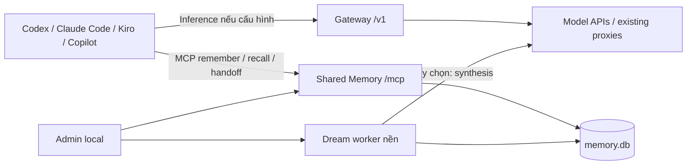

# Shared Memory và Dreaming cho nhiều coding agent

**Ngày:** 2026-09-26. **Trạng thái:** đề xuất kiến trúc, chưa implement.

**Yêu cầu bổ sung của người dùng:** Kiro, Claude Code, Copilot và Codex dùng chung memory để kiến thức không phân tán khi đổi agent. Local cá nhân, Docker và .NET vẫn là ràng buộc. Tài liệu này bổ sung [kiến trúc gateway](ARCHITECTURE_VI.md) và [kế hoạch](IMPLEMENTATION_PLAN_VI.md).

**Giả định đề xuất, chưa được chốt:** ghi có chọn lọc các quyết định, bài học và bàn giao; dreaming tổng hợp định kỳ. Chưa mặc định thu thập toàn bộ hội thoại. Mức tự động hóa có thể điều chỉnh theo phản hồi người dùng.

## 1. Hai năng lực dùng chung

1. **Inference gateway:** chọn model/provider, giữ protocol và streaming.
2. **Shared memory:** lưu/tìm kiến thức dự án qua MCP; dreaming tổ chức lại dữ liệu đã lưu.

Cùng một ứng dụng local quản trị cả hai, nhưng hai đường xử lý độc lập. Client có thể dùng memory trong khi vẫn gọi model trực tiếp bằng subscription của nó. Memory không phụ thuộc việc mọi client có cấu hình custom model endpoint.



Đây là chia sẻ kiến thức có thể truy xuất. Không đồng bộ được hidden reasoning, KV cache hay private session state giữa các sản phẩm. Memory hỗ trợ tiếp tục công việc; workspace/files/Git và tool state vẫn cần tồn tại ở client. Implementation hiện tại có tool `memory_dream` chạy khi agent chủ động gọi; lịch/background worker chưa triển khai.

## 2. Vì sao chọn MCP

Tài liệu chính thức có đường cấu hình MCP cho:

- [Codex](https://developers.openai.com/codex/mcp): stdio và Streamable HTTP.
- [Claude Code](https://code.claude.com/docs/en/mcp): HTTP/stdio.
- [Kiro](https://kiro.dev/docs/mcp/configuration/): server local và remote, URL/header cấu hình được.
- [VS Code Copilot](https://code.visualstudio.com/docs/agent-customization/mcp-servers): cấu hình MCP server trong client.

Đây là bằng chứng có cơ chế tích hợp, **chưa phải bốn client đã được live-test với server của mình**. Copilot CLI/SDK, Codex CLI/IDE/App và Kiro IDE/CLI cần profile/version riêng.

Một MCP server dùng chung không đảm bảo agent tự gọi memory ở mọi phiên. Cần instructions theo client: recall khi bắt đầu task và trước quyết định quan trọng; remember khi có quyết định/bài học; handoff khi kết thúc hoặc đổi agent. Hooks chỉ bổ sung ở client có lifecycle được kiểm chứng, không hứa auto-capture phổ quát.

Kiro MCP support được đánh giá độc lập với Kiro custom inference endpoint còn chưa xác minh trong nghiên cứu ban đầu.

## 3. Phương án implementation

| Phương án | Ưu điểm | Chi phí/giới hạn |
|---|---|---|
| **.NET Memory module + SQLite + MCP** | Một container/runtime, chung admin/backup, kiểm soát scope/lifecycle | Cần viết recall/consolidation tối thiểu |
| Mnemopi/Bun sidecar + MCP facade | Tận dụng engine memory hiện có | Hai runtime; cần facade/transport, scope và crash/locking tests |
| Chỉ dùng file Markdown chung | Dễ đọc và version control | Search/concurrent writes/dreaming/versioning khó hơn |

**Đề xuất:** .NET native cho memory contract/storage/MCP và dreaming tối thiểu; học invariant từ mnemopi. Không port toàn bộ thuật toán của engine ngay. Dùng [MCP C# SDK chính thức](https://github.com/modelcontextprotocol/csharp-sdk), gói HTTP cho ASP.NET Core; pin version khi implement.

Nếu mục tiêu chuyển thành dùng nguyên engine mnemopi, chọn sidecar sau spike conformance; không để hai engine cùng ghi một schema/database. Có thể giữ abstraction IMemoryStore để thay backend mà không đổi client tools.

## 4. Phần mnemopi đã kiểm tra thêm

Nguồn local:

- [README](../../oh-my-pi/packages/mnemopi/README.md): SQLite, remember/recall/sleep, optional embeddings/LLM; package chỉ có banks, host wrapper chịu project scoping.
- [mcp-tools.ts](../../oh-my-pi/packages/mnemopi/src/mcp-tools.ts): có mnemopi_shared_remember, shared_recall, shared_forget và sleep ngoài các tool thông thường.
- [mcp-server.ts](../../oh-my-pi/packages/mnemopi/src/mcp-server.ts): runMcpServer từ chối transport khác stdio; không thể coi bản local là HTTP service sẵn.
- [beam/consolidate.ts](../../oh-my-pi/packages/mnemopi/src/core/beam/consolidate.ts): đường sleep đã đọc hợp nhất working memories thành episodic summaries, dùng cơ chế claim; kết quả ghi method=aaak, llm_used=0 và conflicts_resolved=0. Không suy từ tên sleep rằng path này có LLM reasoning hoặc tự giải quyết xung đột.

Dreaming trong thiết kế mới là tên cho công việc hợp nhất memory nền, không phải khẳng định đang tái tạo đúng feature độc quyền của Claude hoặc toàn bộ engine mnemopi.

PDF [dreamming-memory.pdf](../../documents-research/dreamming-memory.pdf) có 7 trang; kiểm tra bổ sung cho thấy content streams đã xem chứa glyph vector paths, chưa trích được văn bản đầy đủ. Thiết kế này dựa vào mục tiêu người dùng, source đã đọc và MCP docs; chưa tuyên bố parity với nội dung PDF.

## 5. Dữ liệu cần chia sẻ

| Loại | Ví dụ | Hiệu lực |
|---|---|---|
| Preference | Trả lời tiếng Việt, convention cá nhân | Global cá nhân, opt-in |
| Project fact | .NET 10, SQLite, deployment local | Project, có nguồn và thời điểm |
| Decision | Vì sao chọn Responses native trước | Project, versioned |
| Lesson | Một lỗi SSE và cách đã kiểm thử để sửa | Project, gắn file/commit khi có |
| Handoff | Đang làm gì, đã xong gì, blocker, bước kế tiếp | Task/branch, có hạn sử dụng |
| Observation | Nhận xét chưa được xác nhận | Candidate, không tự nâng thành fact |
| Derived summary | Bản tổng hợp của dreaming | Có liên kết nguồn và nhãn suy ra |

Mỗi record: id, projectId, scope, kind, content, sourceClient, sourceSession, sourceRefs, observedAt, validUntil, revision, status và provenance. Branch/commit là metadata để phát hiện stale, không tự chia mọi fact chung thành kho riêng theo branch.

Dùng **một kho logic, namespace theo project**, không một kho riêng cho từng agent. Client là nguồn đóng góp. Global chỉ cho kiến thức người dùng chủ động chia sẻ; không tự mang business facts của repo A sang B.

ProjectId đăng ký ổn định, map nhiều checkout/worktree/Windows/WSL path về cùng project khi người dùng chọn; không suy identity chỉ từ tên folder, prompt hay Git remote. Memory credential gắn allowed projects; tool argument không tự mở quyền đọc namespace khác.

## 6. Tool contract đề xuất

Endpoint local dự kiến: `http://127.0.0.1:8580/mcp`, Streamable HTTP. Dùng credential memory có scope riêng với inference/admin.

| Tool | Input chính | Output |
|---|---|---|
| memory_recall | project_id, query, task/branch tùy chọn, limit | Items + source/status/score/revision; response giới hạn |
| memory_get | project_id, memory_id | Nội dung đầy đủ và provenance theo quyền |
| memory_remember | project_id, kind, content, source_refs, idempotency_key | id, revision, candidate/recorded status |
| memory_handoff | project_id, task_id, summary, next_steps, refs, expected_revision | Handoff revision mới hoặc conflict |
| memory_invalidate | project_id, memory_id, reason, expected_revision | Superseded/invalidated revision |

Forget/purge và chạy dreaming thủ công nằm trong admin trước; không expose thao tác xóa hàng loạt hoặc chạy LLM job không giới hạn cho mọi agent. Tools trên là contract mới của gateway, không phải tên API có sẵn của mnemopi.

Recall trả tối đa 8 items, tổng 12.000 ký tự mặc định, có truncated flag và ID để get thêm; đây là giới hạn khởi đầu cần benchmark. Filter project/status/expiry trước ranking, không lấy top-k toàn kho rồi mới lọc.

Bắt đầu SQLite FTS5 + recency/kind/source weighting. Embeddings là bổ sung sau benchmark Việt/Anh; chọn model đa ngôn ngữ và version index, không giả định model tiếng Anh mặc định của mnemopi phù hợp. Đổi embedding model phải reindex; lỗi embedding còn FTS fallback.

## 7. Dreaming workflow

```text
Selective writes / handoff
  -> durable observations
  -> claim bounded batch theo project
  -> deduplicate + detect possible conflicts/stale facts
  -> deterministic digest hoặc optional LLM synthesis
  -> validate structured result + source references
  -> commit derived revisions
  -> update recall index
```

- Worker không nằm trong response streaming. Inference không chờ dreaming.
- Bản đầu chạy thủ công; sau nghiệm thu có thể bật lịch, ví dụ mỗi 6 giờ nếu có dữ liệu mới. Đây là đề xuất, không phải đã bật.
- Một job đồng thời, tối đa 50 records/batch; claim có expiry/retry và idempotency. Không giữ SQLite transaction khi gọi LLM.
- LLM dùng connection/model do người dùng cấu hình, có timeout/token/cost cap; hết budget giữ pending, không tự đổi model/provider.
- Nếu gọi inference core qua nội bộ, đánh dấu purpose=memory_consolidation và tắt memory capture/recall enrichment cho job, tránh vòng lặp tự học từ chính bản tóm tắt.
- Exact duplicates có thể hợp nhất theo quy tắc. LLM summary mang nhãn derived, không tự thành confirmed fact.
- Mâu thuẫn như “dùng SQL Server” và “đã chuyển SQLite” phải giữ nguồn/thời điểm, supersede khi có evidence phù hợp hoặc đưa vào review; không chọn câu có số lần lặp lớn hơn.
- Summary không xóa observations nguồn mặc định. Xóa/invalidate nguồn phải invalidate/rebuild derived summary liên quan để điều đã quên không quay lại qua index.
- Dreaming không fine-tune model. Chất lượng phụ thuộc dữ liệu đã ghi, retrieval và việc client thực sự đọc chúng.

## 8. Deployment và bảo vệ dữ liệu local

Giữ một .NET container. Memory là module riêng trong cùng host: `Core/Memory`, `Infrastructure/Memory`, `Host/Mcp`, `Host/Pages/Admin/Memory`; BackgroundService chạy worker. Dùng memory.db tách gateway.db, WAL và single writer theo database để giảm ảnh hưởng inference metadata.

Memory.db chứa kiến thức được chủ động lưu; quy tắc "không persist prompt mặc định" của inference vẫn giữ. Proposed defaults: handoff TTL 14 ngày; observations 90 ngày; fact/decision giữ tới khi superseded/forget. Đây là cấu hình sản phẩm cần review, khác retention request logs 7 ngày.

SQLite plaintext/FTS/vector index không tự được mã hóa nhờ mã hóa upstream credential. V1 local dùng filesystem permissions và volume/host encryption nếu cần; không hứa per-record AES bảo vệ cả FTS index. Backup memory.db và derived indexes chứa dữ liệu project, cần cùng chính sách bảo vệ.

MCP HTTP có authentication, Host/Origin validation và loopback binding; permission theo client/project. Secrets không được lưu vào memory qua capture tự động. Recall result là dữ liệu tham khảo, không phải system instruction; không tự thực thi chỉ dẫn nhúng trong memory.

Memory hỏng/tạm offline: inference vẫn hoạt động, tool trả lỗi rõ, không giả kết quả rỗng hoặc báo remember thành công khi chưa persist. Client cần đọc file hiện tại để xác minh thông tin cũ; memory không thay source of truth của repository.

## 9. Backlog bổ sung: mốc Shared Memory giữa M1 và V1

Đây là phần scope chính sau yêu cầu mới; không còn bị đẩy toàn bộ sang phần mở rộng xa. Các bước chỉ được thực thi sau `start implement`.

| Task | File dự kiến trong src/AgenticGateway.* | Test và gate |
|---|---|---|
| MEM-1: project identity/store | Core/Memory/MemoryRecord.cs, MemoryScope.cs, IMemoryStore.cs; Infrastructure/Memory/MemoryDbContext.cs, MemoryStore.cs | Hai client chung project thấy cùng record; project khác không thấy; revision/idempotency/expiry/restart |
| MEM-2: MCP và recall | Host/Mcp/MemoryTools.cs; Core/Memory/MemoryRecallService.cs; Infrastructure/Memory/FtsMemoryIndex.cs | MCP initialize/tools/list/call, auth/scope, bounded result, FTS Việt/Anh, invalidation và concurrent writes |
| MEM-3: client handoff | docs/clients/* và tests/client-e2e/memory/ | Codex ghi → Claude/Kiro/Copilot đọc đúng source; update → client khác nhận revision mới; test khi model không đi qua gateway |
| MEM-4: dreaming | Core/Memory/DreamJob.cs, DreamResultValidator.cs; Infrastructure/Memory/DreamWorker.cs, DreamJobStore.cs | Crash/retry không nhân đôi; conflict không overwrite fact; provenance; delete cascade; LLM malformed/timeout/budget |
| MEM-5: quản trị/operations | Host/Pages/Admin/Memory/*; docs/operations/MEMORY.md | Search/review/supersede/forget/export/restore; inference không bị chặn khi memory job lỗi |

Interfaces định hướng: IMemoryStore.AppendAsync(record, idempotencyKey, ct), GetAsync(scope,id,ct), UpdateAsync(scope,id,expectedRevision,change,ct); IMemoryRecall.SearchAsync(scope,query,limits,ct); IDreamRunner.RunAsync(projectId,batchLimit,ct). Chốt DTO/signature cụ thể trước khi implement MEM-1, không ràng buộc client vào SQLite schema.

Ước lượng bổ sung **8–14 ngày làm việc** cho bản chọn lọc + MCP + dreaming cơ bản; chưa gồm thu toàn hội thoại/hook riêng mọi client hoặc parity toàn engine mnemopi. V1 tổng mới khoảng **33–54 ngày**, chưa tính account connectors. Ước lượng sẽ sửa sau lựa chọn mức tự động hóa.

**Nghiệm thu chính:** Agent A ghi “SQLite đã được chọn vì deploy local”; agent B trên cùng project recall đúng quyết định và nguồn; agent C tiếp tục task từ handoff; project khác không lẫn dữ liệu; dreaming tạo bản tổng hợp có nguồn, không làm mất quyết định mới hoặc hồi sinh record đã forget.
